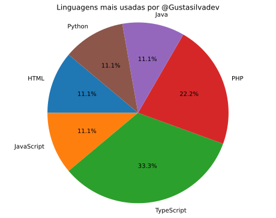

<h1 align="center">Olá! Eu sou o Gustavo Martins 👋</h1>

  Desenvolvedor Front-end e Back-end

---

### 🚀 Sobre mim

Sou um desenvolvedor focado em construir aplicações modernas, escaláveis e com ótimo design de interface. Gosto de transformar ideias em interfaces funcionais e intuitivas usando ferramentas como **Angular**, **TypeScript**, **JavaScript** e **Figma**.

Atualmente, estou sempre estudando novas ferramentas e melhores práticas para melhorar meus projetos e entregas.

---

### 🛠️ Tecnologias e Ferramentas

 
  
  
  
  
  
  
  
  

---

### 📊 Minhas Estatísticas no GitHub

  Confira abaixo o gráfico com as linguagens que mais uso nos meus repositórios.

  

---

📝 *Este README é atualizado manualmente por mim. Sinta-se à vontade para visitar meus repositórios!*

